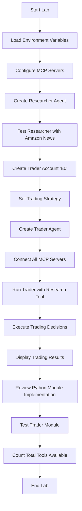
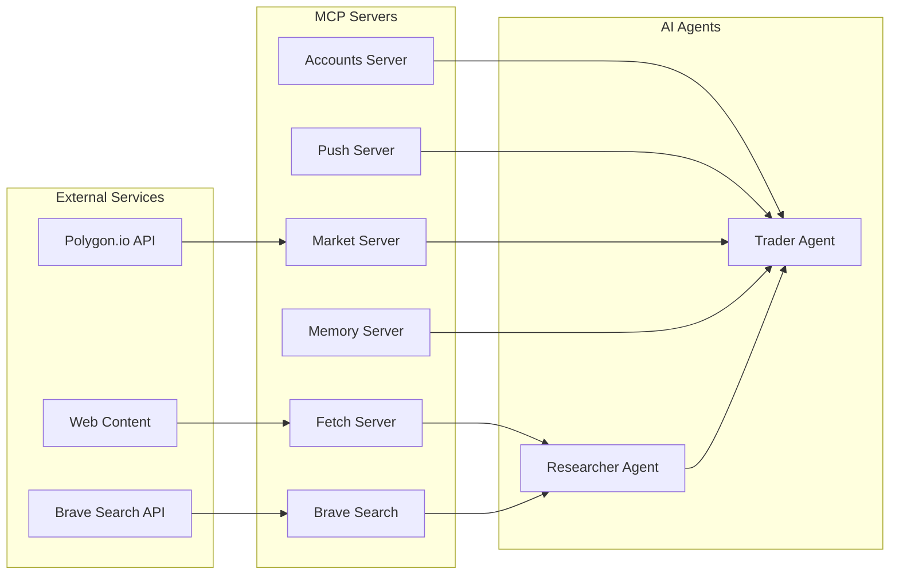

# 4_lab4.ipynb - Autonomous Traders Lab Analysis

## 📋 Summary

This notebook demonstrates the creation of an **Autonomous Trading System** using AI agents powered by MCP (Model Context Protocol) servers. The lab showcases how to build a sophisticated trading simulation where AI agents can autonomously research markets, make trading decisions, and execute trades using multiple specialized tools and services.

### Key Components:
- **Trader Agent**: An AI agent that manages a stock portfolio autonomously
- **Researcher Agent**: An AI agent that conducts market research and provides insights
- **MCP Servers**: 6 different servers providing 16 tools for trading, research, and data access
- **Account Management**: Persistent storage of trader accounts, strategies, and transaction history

---

## 🔄 Event Flow Diagram



---

## 📊 System Architecture Flow



---

## 🎯 Actions Performed

### 1. **Environment Setup**
- Load environment variables from `.env` file
- Check Polygon.io API configuration (free vs paid plans)
- Set up API keys for external services

### 2. **MCP Server Configuration**
- **Trader Servers**: Accounts, Push notifications, Market data
- **Researcher Servers**: Web fetching, Brave search
- Create server connections with timeout settings

### 3. **Researcher Agent Creation**
- Define research instructions and capabilities
- Convert researcher into a reusable tool
- Test with Amazon news research query

### 4. **Trader Account Setup**
- Create trader account "Ed" with $10,000 starting balance
- Set aggressive day trading strategy
- Initialize empty portfolio

### 5. **Trader Agent Implementation**
- Create comprehensive trading instructions
- Integrate researcher tool for market analysis
- Connect to all necessary MCP servers

### 6. **Trading Execution**
- Run autonomous trading simulation
- Agent researches market conditions
- Makes trading decisions and executes trades
- Records transaction history

### 7. **Module Integration**
- Import and test the `traders.py` module
- Demonstrate production-ready implementation
- Count total available tools (16 tools from 6 servers)

---

## 🏢 Non-Technical Analogy

### The Trading Floor Analogy

Imagine a **high-tech investment firm** with specialized departments:

#### 🏢 **The Building (MCP Servers)**
- **Accounts Department**: Keeps track of all money, investments, and transaction records
- **Research Department**: Searches the internet for market news and investment opportunities
- **Market Data Room**: Provides real-time stock prices and financial information
- **Memory Vault**: Stores important insights and lessons learned
- **Notification Center**: Sends alerts about important events
- **Web Scraping Team**: Fetches detailed information from websites

#### 👥 **The Staff (AI Agents)**
- **Senior Researcher**: A brilliant analyst who constantly scans news, websites, and market data to find investment opportunities. They're like a super-intelligent research assistant who never sleeps.

- **Portfolio Manager "Ed"**: A day trader who makes quick buying and selling decisions. They have access to all the firm's resources and can act independently without asking permission.

#### 🔄 **The Daily Process**
1. **Morning Briefing**: The researcher scans the latest news and market conditions
2. **Strategy Session**: The trader reviews their current portfolio and investment strategy
3. **Market Analysis**: Using all available tools, the trader researches specific stocks
4. **Decision Making**: Based on research, the trader decides what to buy or sell
5. **Execution**: The trader places trades and updates their portfolio
6. **Record Keeping**: All actions are recorded for future reference

#### 🎯 **The Magic**
The amazing part is that both the researcher and trader are **AI robots** that can work 24/7, never get tired, and can process information faster than any human. They communicate with each other and use all the firm's resources automatically to make smart investment decisions.

---

## 📖 User Guide

### Prerequisites
1. **Environment Setup**
   ```bash
   # Ensure you have the required API keys in .env file
   POLYGON_API_KEY=your_polygon_key
   BRAVE_API_KEY=your_brave_key
   OPENAI_API_KEY=your_openai_key
   ```

2. **Dependencies**
   - Python 3.12+
   - OpenAI Agents SDK
   - MCP servers installed
   - Required Python packages

### Step-by-Step Usage

#### 1. **Start the Lab**
   ```python
   # Run the first cell to load dependencies
   import os
   from dotenv import load_dotenv
   # ... other imports
   ```

#### 2. **Configure Trading Environment**
   - The system automatically detects your Polygon.io plan
   - Sets up appropriate market data sources
   - Configures MCP servers based on available APIs

#### 3. **Create Your Trader**
   ```python
   # The system creates a trader named "Ed"
   # Starting with $10,000 and day trading strategy
   agent_name = "Ed"
   ```

#### 4. **Run Autonomous Trading**
   ```python
   # Execute the trading simulation
   await trader.run()
   ```

#### 5. **Monitor Results**
   - Check the OpenAI traces dashboard
   - Review trading decisions and portfolio changes
   - Analyze the agent's reasoning process

### Understanding the Output

#### **Trading Results**
- **Portfolio Value**: Current total value of investments
- **Holdings**: Stocks currently owned
- **Transactions**: History of all buy/sell decisions
- **Profit/Loss**: Performance tracking

#### **Research Output**
- **Market Analysis**: Latest news and trends
- **Investment Opportunities**: Identified trading prospects
- **Risk Assessment**: Market condition analysis

### Customization Options

#### **Trading Strategies**
```python
# Modify the trader's strategy
strategy = "Your custom investment strategy here"
Account.get("Ed").reset(strategy)
```

#### **Research Focus**
```python
# Change research topics
research_question = "What's the latest news on [YOUR_STOCK]?"
```

#### **Portfolio Settings**
```python
# Adjust starting balance
Account.get("Ed").reset(strategy, initial_balance=50000)
```

### Troubleshooting

#### **Common Issues**
1. **API Key Errors**: Ensure all required keys are in `.env` file
2. **MCP Server Failures**: Check server installations and connections
3. **Trading Errors**: Verify market data availability and account permissions

#### **Debug Steps**
1. Check OpenAI traces for detailed execution logs
2. Verify MCP server connections
3. Review account and strategy resources
4. Test individual components separately

### Best Practices

1. **Start Small**: Begin with small amounts to test the system
2. **Monitor Closely**: Watch the traces to understand agent behavior
3. **Customize Gradually**: Modify strategies based on observed performance
4. **Regular Reviews**: Check portfolio performance and adjust as needed

---

## 🔧 Technical Implementation Details

### MCP Server Architecture
- **6 Servers**: Accounts, Push, Market, Fetch, Brave Search, Memory
- **16 Tools**: Total capabilities across all servers
- **Async Operations**: Non-blocking server connections
- **Error Handling**: Robust failure management

### Agent Design Patterns
- **Tool Integration**: Seamless MCP server tool usage
- **Resource Access**: Direct account and strategy data access
- **Autonomous Operation**: Independent decision-making capability
- **Trace Integration**: Comprehensive logging and monitoring

### Data Flow
1. **Input**: Market data, news, account information
2. **Processing**: AI analysis and decision-making
3. **Output**: Trading decisions, portfolio updates
4. **Storage**: Persistent account and transaction records

---

## 🎉 Key Takeaways

This lab demonstrates the power of **autonomous AI agents** in financial applications:

1. **Multi-Agent Systems**: How different AI agents can work together
2. **Tool Integration**: Seamless connection of specialized services
3. **Autonomous Decision Making**: AI agents making real financial decisions
4. **Production Readiness**: Moving from notebook experiments to deployable modules
5. **Comprehensive Monitoring**: Full visibility into agent behavior and decisions

The system showcases how modern AI can create sophisticated, autonomous trading systems that can research markets, make decisions, and execute trades without human intervention - all while maintaining full transparency and control.

---

*This analysis covers the complete 4_lab4.ipynb notebook, providing both technical depth and accessible explanations for understanding autonomous trading systems powered by AI agents and MCP servers.*
