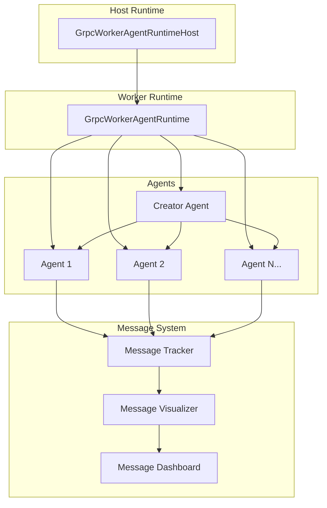

# 🤖 AutoGen Multi-Agent System with Innovative Messaging

[](https://www.python.org/downloads/)
[](https://github.com/microsoft/autogen)
[](https://opensource.org/licenses/MIT)

A comprehensive multi-agent system built with AutoGen that features dynamic agent creation, distributed runtime, and an innovative message tracking and visualization system.

## 📋 Documentation Index

| Document | Description | Link |
|----------|-------------|------|
| **📖 Main README** | Complete system overview and features | [readmeautogen.md](readmeautogen.md) |
| **🎯 Features Overview** | Detailed feature breakdown and capabilities | [features_overview.md](features_overview.md) |
| **📖 User Guide** | Step-by-step usage instructions | [user_guide.md](user_guide.md) |
| **🔄 Event Diagrams** | System architecture and event flow diagrams | [event_diagram.md](event_diagram.md) |

## 🚀 Quick Start

### Installation
```bash
# Clone repository
git clone <repository-url>
cd agents/5_autogen

# Install dependencies
pip install -r requirements.txt

# Set up environment
echo "OPENAI_API_KEY=your_api_key_here" > .env
```

### Run the System
```bash
# Start the main system
python world.py

# Launch interactive dashboard
python launch_dashboard.py

# Run comprehensive test
python test_innovative_messaging.py
```

## ✨ Key Features

### 🤖 Dynamic Agent Creation
- **Creator Agent**: Automatically generates specialized agents
- **Code Generation**: Creates Python code for new agents
- **Agent Registration**: Automatic registration with runtime
- **Multiple Agent Types**: Entrepreneur, Creator, Marketing Strategist, etc.

### 📨 Advanced Message System
- **Message Tracking**: Complete tracking of all message exchanges
- **Originator/Target Details**: Comprehensive agent information
- **Response Time Tracking**: Precise performance measurement
- **Conversation Threading**: Grouped related exchanges

### 🎨 Innovative Visualization
- **Message Flow Visualization**: Animated message exchanges
- **Agent Network Mapping**: Visual agent connections
- **Real-time Dashboard**: Live system monitoring
- **Performance Analytics**: Detailed metrics and rankings

### 🔧 Distributed Runtime
- **Host Runtime**: Centralized coordination
- **Worker Runtime**: Individual agent execution
- **Message Routing**: Intelligent message distribution
- **Error Handling**: Robust error recovery

## 📊 System Architecture



## 🎯 Use Cases

- **🏢 Business Applications**: Customer service, sales automation, process automation
- **🧪 Research & Development**: Multi-agent research, AI development, simulation
- **🎓 Education & Training**: AI education, system design, programming
- **🔬 Scientific Applications**: Data analysis, simulation, optimization

## 📁 File Structure

```
agents/5_autogen/
├── 📄 agent.py                    # Base agent template
├── 📄 creator.py                  # Creator agent
├── 📄 messages.py                 # Message classes
├── 📄 world.py                    # Main orchestration
├── 📄 message_tracker.py          # Message tracking system
├── 📄 message_visualizer.py       # Visualization system
├── 📄 message_dashboard.py        # Interactive dashboard
├── 📄 test_innovative_messaging.py # Test script
├── 📄 launch_dashboard.py         # Dashboard launcher
├── 📄 readmeautogen.md            # Complete documentation
├── 📄 features_overview.md        # Features breakdown
├── 📄 user_guide.md               # Usage instructions
├── 📄 event_diagram.md            # Event flow diagrams
└── 📁 sandbox/                    # Agent-generated files
```

## 🧪 Testing

```bash
# Run comprehensive test
python test_innovative_messaging.py

# Test individual components
python -c "from message_tracker import message_tracker; print('OK')"
python -c "from message_visualizer import message_visualizer; print('OK')"
python -c "from message_dashboard import MessageDashboard; print('OK')"
```

## 📈 Performance Metrics

- **Message Exchange Rate**: Messages per second
- **Response Time**: Average message processing time
- **Success Rate**: Percentage of successful exchanges
- **Agent Activity**: Messages sent/received per agent
- **System Uptime**: Runtime availability

## 🔧 Configuration

### Environment Variables
```bash
OPENAI_API_KEY=your_api_key_here
RUNTIME_HOST=localhost
RUNTIME_PORT=50051
LOG_LEVEL=INFO
```

### Agent Configuration
```python
agent_config = {
    "model": "gpt-4.1-mini",
    "temperature": 0.7,
    "max_tokens": 1000,
    "price": [0.00015, 0.0006]
}
```

## 🎛️ Interactive Dashboard

The system includes a comprehensive interactive dashboard with:

1. **📊 Real-time Statistics** - Live system metrics
2. **🕸️ Agent Network Visualization** - Agent connections
3. **💬 Conversation Threads** - Message flow analysis
4. **📨 Recent Message Exchanges** - Latest communications
5. **🔄 Live Message Flow Monitor** - Real-time monitoring
6. **📈 Agent Activity Analysis** - Performance analysis
7. **📁 Export Message Data** - Data export functionality
8. **🎨 Message Flow Visualization** - Detailed flow analysis

## 🚀 Getting Started

1. **Read the Documentation**: Start with [readmeautogen.md](readmeautogen.md)
2. **Explore Features**: Check [features_overview.md](features_overview.md)
3. **Follow User Guide**: Use [user_guide.md](user_guide.md)
4. **Understand Events**: Review [event_diagram.md](event_diagram.md)
5. **Run the System**: Execute `python world.py`
6. **Launch Dashboard**: Run `python launch_dashboard.py`

## 🤝 Contributing

1. Fork the repository
2. Create a feature branch
3. Make your changes
4. Add tests for new features
5. Submit a pull request

## 📄 License

This project is licensed under the MIT License - see the LICENSE file for details.

## 🆘 Support

- 📧 **Email**: [your-email@example.com]
- 🐛 **Issues**: [GitHub Issues](https://github.com/your-repo/issues)
- 📖 **Documentation**: [Project Wiki](https://github.com/your-repo/wiki)
- 💬 **Discussions**: [GitHub Discussions](https://github.com/your-repo/discussions)

---

**Built with ❤️ using AutoGen and Python**

*Last updated: September 15, 2025*
