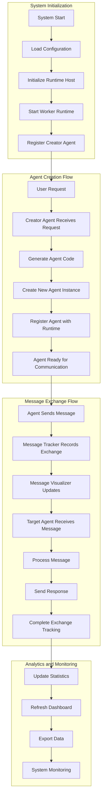
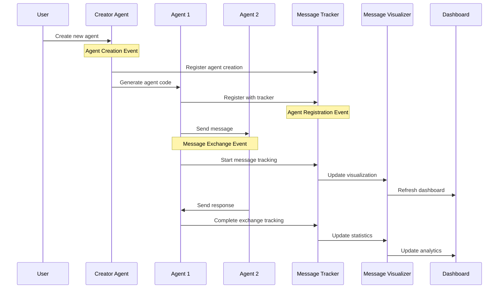
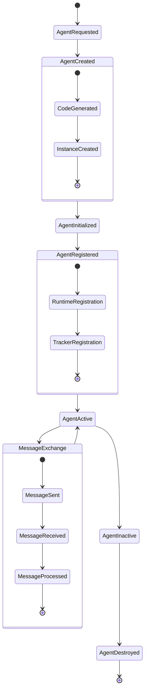
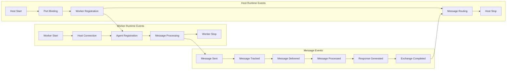
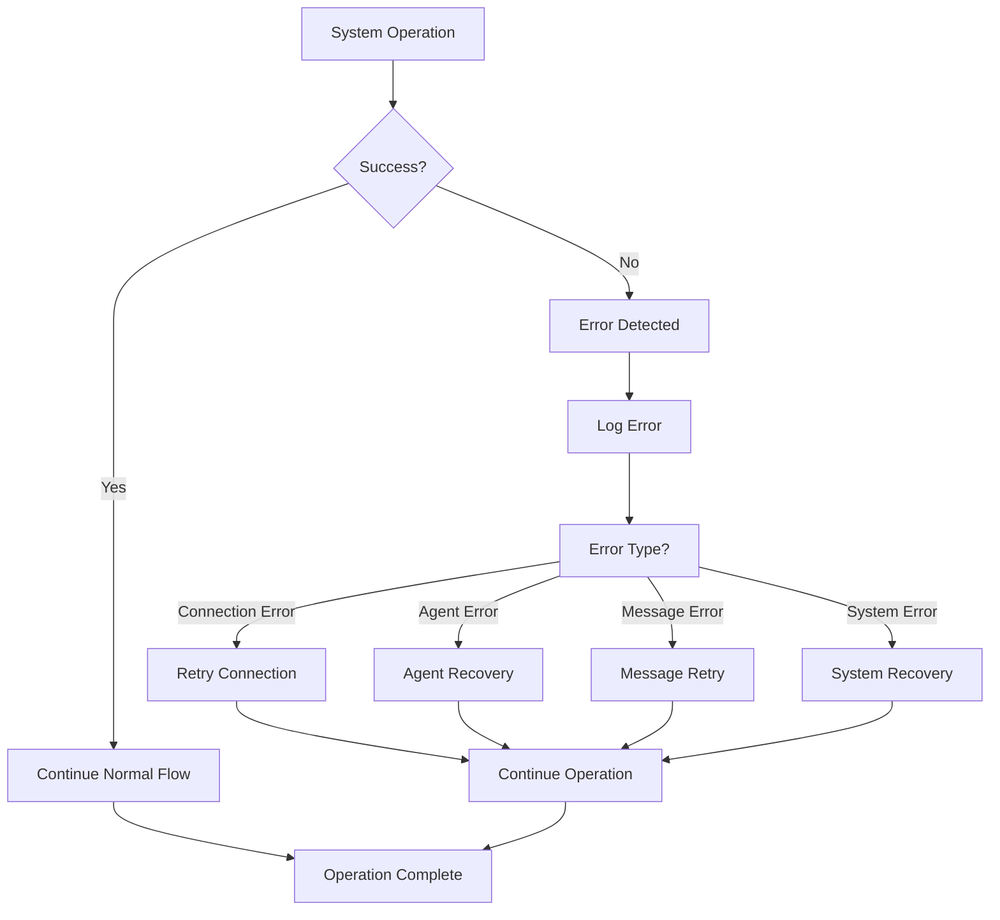
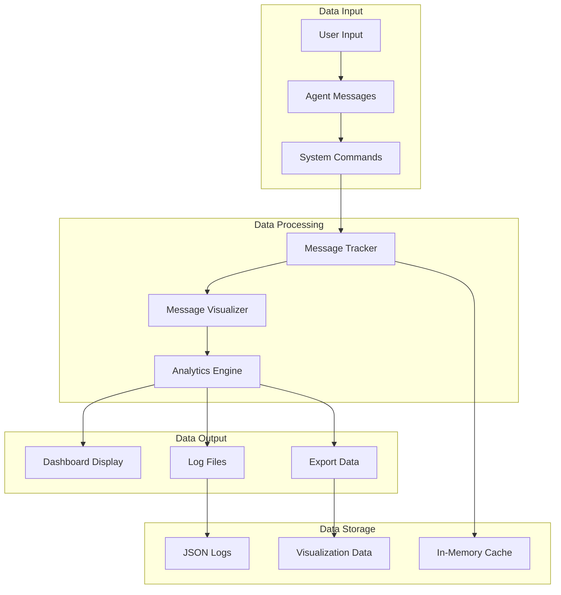
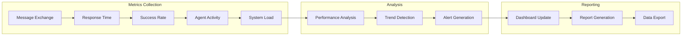

# 🔄 AutoGen System Event Flow Diagrams

## System Architecture Event Flow



## Message Exchange Event Sequence



## Agent Lifecycle Events



## Runtime System Events



## Error Handling Event Flow



## Data Flow Events



## Performance Monitoring Events



## Event Timeline

```
Timeline of System Events:

00:00:00 - System Initialization
├── 00:00:01 - Runtime Host Started
├── 00:00:02 - Worker Runtime Connected
├── 00:00:03 - Creator Agent Registered
└── 00:00:04 - System Ready

00:00:05 - Agent Creation
├── 00:00:06 - User Request Received
├── 00:00:07 - Agent Code Generated
├── 00:00:08 - Agent Instance Created
├── 00:00:09 - Agent Registered
└── 00:00:10 - Agent Active

00:00:11 - Message Exchange
├── 00:00:12 - Message Sent
├── 00:00:13 - Message Tracked
├── 00:00:14 - Message Delivered
├── 00:00:15 - Message Processed
├── 00:00:16 - Response Generated
└── 00:00:17 - Exchange Completed

00:00:18 - Analytics Update
├── 00:00:19 - Statistics Updated
├── 00:00:20 - Dashboard Refreshed
├── 00:00:21 - Visualization Updated
└── 00:00:22 - Data Exported
```

## Event Categories

### 🏗️ System Events
- **System Start**: Initial system startup
- **System Stop**: System shutdown
- **Runtime Start**: Runtime initialization
- **Runtime Stop**: Runtime shutdown

### 🤖 Agent Events
- **Agent Created**: New agent instantiated
- **Agent Registered**: Agent registered with runtime
- **Agent Active**: Agent ready for communication
- **Agent Inactive**: Agent temporarily unavailable
- **Agent Destroyed**: Agent removed from system

### 📨 Message Events
- **Message Sent**: Message dispatched
- **Message Received**: Message received by target
- **Message Processed**: Message successfully processed
- **Message Failed**: Message processing failed
- **Exchange Started**: Message exchange initiated
- **Exchange Completed**: Message exchange finished

### 📊 Analytics Events
- **Statistics Updated**: Performance metrics updated
- **Dashboard Refreshed**: Real-time dashboard updated
- **Data Exported**: Message data exported
- **Visualization Updated**: Message flow visualization updated

### 🔧 Runtime Events
- **Worker Connected**: Worker connected to host
- **Worker Disconnected**: Worker disconnected from host
- **Message Routed**: Message routed between agents
- **Error Occurred**: System error detected

---

*This document provides comprehensive event flow diagrams for the AutoGen Multi-Agent System with Innovative Messaging.*
