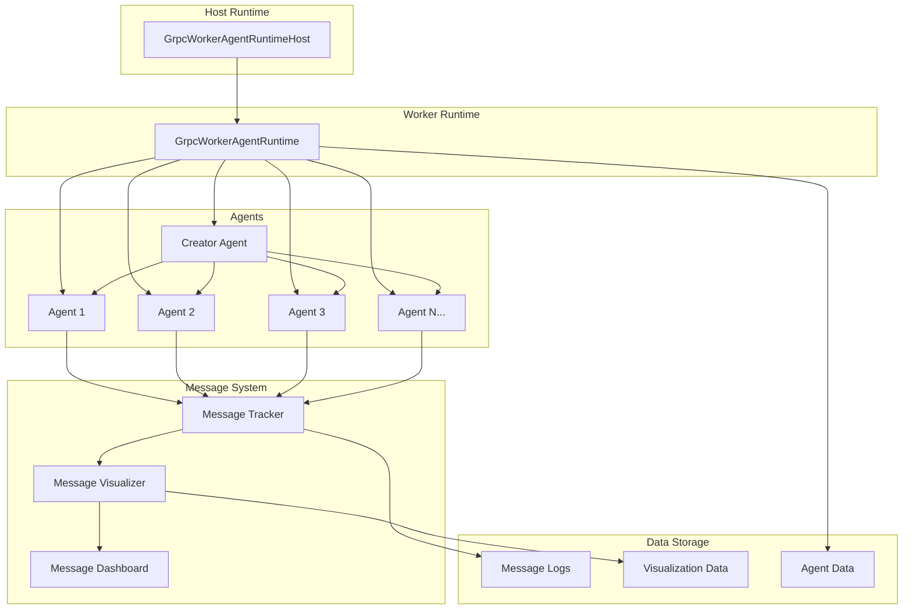
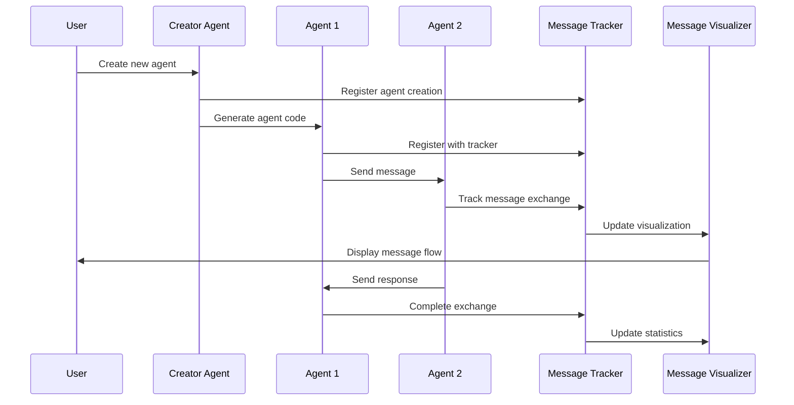
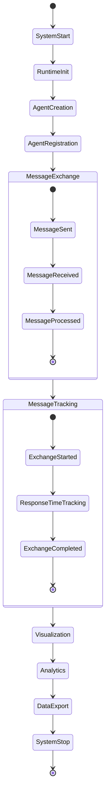

# 🤖 AutoGen Multi-Agent System with Innovative Messaging

A comprehensive multi-agent system built with AutoGen that features dynamic agent creation, distributed runtime, and an innovative message tracking and visualization system.

## 📋 Table of Contents

- [🎯 Overview](#-overview)
- [✨ Features](#-features)
- [🏗️ Architecture](#️-architecture)
- [📊 Event System](#-event-system)
- [🎨 Message Visualization](#-message-visualization)
- [🚀 Getting Started](#-getting-started)
- [📖 User Guide](#-user-guide)
- [🔧 Configuration](#-configuration)
- [📁 File Structure](#-file-structure)
- [🧪 Testing](#-testing)
- [📈 Performance Metrics](#-performance-metrics)
- [🔍 Troubleshooting](#-troubleshooting)
- [🤝 Contributing](#-contributing)
- [📄 License](#-license)

## 🎯 Overview

This AutoGen system implements a sophisticated multi-agent architecture where agents can dynamically create other agents, communicate through a distributed runtime, and track all message exchanges with detailed visualization. The system is designed for scalability, real-time monitoring, and comprehensive analytics.

### Key Capabilities

- **Dynamic Agent Creation**: Agents can create new specialized agents on-demand
- **Distributed Runtime**: Simulated distributed environment with worker and host components
- **Message Tracking**: Complete visibility into all agent communications
- **Real-time Visualization**: Live dashboard with animated message flows
- **Performance Analytics**: Detailed metrics and agent activity analysis
- **Data Export**: Complete message logs and visualization data export

## ✨ Features

### 🤖 Agent Management
- **Dynamic Agent Creation**: Creator agent generates specialized agents based on requirements
- **Agent Registration**: Automatic registration and lifecycle management
- **Agent Types**: Support for different agent specializations (entrepreneur, creator, marketing_strategist)
- **Runtime Integration**: Seamless integration with distributed runtime system

### 📨 Message System
- **Message Tracking**: Complete tracking of all message exchanges
- **Originator/Target Details**: Detailed information about sending and receiving agents
- **Message Types**: Categorized message types (idea_exchange, campaign_exchange, etc.)
- **Response Time Tracking**: Precise measurement of message processing times
- **Conversation Threading**: Grouped related message exchanges

### 🎨 Visualization & Analytics
- **Real-time Dashboard**: Live monitoring of agent activities
- **Message Flow Visualization**: Animated display of message exchanges
- **Agent Network Mapping**: Visual representation of agent connections
- **Performance Metrics**: Comprehensive statistics and rankings
- **Data Export**: JSON export of complete message logs

### 🔧 Runtime System
- **Distributed Architecture**: Simulated distributed environment
- **Worker Management**: Multiple worker runtime support
- **Host Coordination**: Centralized host for agent coordination
- **Message Routing**: Intelligent message routing between agents
- **Error Handling**: Robust error handling and recovery

## 🏗️ Architecture

### System Components



### Agent Communication Flow



## 📊 Event System

### Event Types

#### 🏗️ Agent Events
- **Agent Created**: New agent instantiated
- **Agent Registered**: Agent registered with runtime
- **Agent Initialized**: Agent fully configured and ready
- **Agent Destroyed**: Agent removed from system

#### 📨 Message Events
- **Message Sent**: Message dispatched from originator
- **Message Received**: Message received by target
- **Message Processed**: Message successfully processed
- **Message Failed**: Message processing failed
- **Exchange Started**: Message exchange initiated
- **Exchange Completed**: Message exchange finished

#### 🔄 Runtime Events
- **Runtime Started**: Runtime system initialized
- **Runtime Stopped**: Runtime system shutdown
- **Worker Connected**: Worker connected to host
- **Worker Disconnected**: Worker disconnected from host

#### 📊 Analytics Events
- **Statistics Updated**: Performance metrics updated
- **Dashboard Refreshed**: Real-time dashboard updated
- **Data Exported**: Message data exported to files
- **Visualization Updated**: Message flow visualization updated

### Event Flow Diagram



## 🎨 Message Visualization

### Visual Components

#### 📨 Message Flow Display
```
================================================================================
📨 MESSAGE FLOW VISUALIZATION
================================================================================
👤 ORIGINATOR: agent2
   🆔 ID: agent2
   🏷️ Type: entrepreneur
   📊 Messages Sent: 1
   🕐 Last Seen: 2025-09-15T14:33:51.766148
   →   →   →   →   →
🎯 TARGET: default
   🆔 ID: default
   🏷️ Type: unknown
   📊 Messages Received: 0
   🕐 Last Seen: 2025-09-15T14:33:41.612245

📝 MESSAGE DETAILS:
   🏷️ Type: idea_exchange
   📏 Length: 3228 characters
   🕐 Timestamp: 2025-09-15T14:33:51.766148
   💬 Conversation: 22bfea0e
   📊 Status: processed

⏱️ RESPONSE TIME: 12059.52ms
================================================================================
```

#### 🕸️ Agent Network Visualization
```
================================================================================
🕸️ AGENT NETWORK VISUALIZATION
================================================================================

🤖 agent2 (agent2)
   🔗 Connected to:
      • default (default)

🤖 agent_test (agent_test)
   🔗 Connected to:
      • default (default)
================================================================================
```

#### 📊 Real-time Statistics
```
================================================================================
🤖 MULTI-AGENT MESSAGE DASHBOARD
================================================================================
📊 Total Exchanges: 2
✅ Successful: 2
❌ Failed: 0
⏱️ Avg Response Time: 17401.93ms
🔥 Most Active Agent: agent_test
💬 Longest Conversation: 1 messages
================================================================================
```

## 🚀 Getting Started

### Prerequisites

- Python 3.9+
- OpenAI API Key
- Required Python packages (see requirements below)

### Installation

1. **Clone the repository**
   ```bash
   git clone <repository-url>
   cd agents/5_autogen
   ```

2. **Install dependencies**
   ```bash
   pip install -r requirements.txt
   # or
   uv add pyautogen
   ```

3. **Set up environment variables**
   ```bash
   # Create .env file
   echo "OPENAI_API_KEY=your_api_key_here" > .env
   ```

4. **Run the system**
   ```bash
   python world.py
   ```

### Quick Start

1. **Test the innovative messaging system**
   ```bash
   python test_innovative_messaging.py
   ```

2. **Launch interactive dashboard**
   ```bash
   python launch_dashboard.py
   ```

3. **Run the main world simulation**
   ```bash
   python world.py
   ```

## 📖 User Guide

### 🎛️ Interactive Dashboard

The interactive dashboard provides comprehensive monitoring and control of the multi-agent system.

#### Main Menu Options

1. **📊 Real-time Statistics**
   - View current system statistics
   - Monitor agent activity levels
   - Track message exchange metrics

2. **🕸️ Agent Network Visualization**
   - Visual representation of agent connections
   - Network topology analysis
   - Connection strength indicators

3. **💬 Conversation Threads**
   - Browse available conversations
   - View detailed conversation flows
   - Analyze message patterns

4. **📨 Recent Message Exchanges**
   - View latest message exchanges
   - Monitor real-time communications
   - Track message processing status

5. **🔄 Live Message Flow Monitor**
   - Real-time message flow visualization
   - Animated message exchanges
   - Live system monitoring

6. **📈 Agent Activity Analysis**
   - Detailed agent performance metrics
   - Activity rankings and statistics
   - Performance analysis and insights

7. **📁 Export Message Data**
   - Export complete message logs
   - Generate visualization data
   - Create analysis reports

8. **🎨 Message Flow Visualization**
   - Detailed message flow displays
   - Animated message exchanges
   - Visual message analysis

### 🔧 Configuration

#### Agent Configuration

```python
# Agent initialization
agent = Agent("agent_name")

# Creator agent
creator = Creator("Creator")

# Custom agent types
agent = Agent("specialized_agent")
```

#### Runtime Configuration

```python
# Host runtime
host = GrpcWorkerAgentRuntimeHost(address="localhost:50051")
host.start()

# Worker runtime
worker = GrpcWorkerAgentRuntime(host_address="localhost:50051")
await worker.start()
```

#### Message Tracking Configuration

```python
# Message tracker
from message_tracker import message_tracker

# Register agent
message_tracker.register_agent(
    agent_id="agent1",
    name="Agent 1",
    agent_type="entrepreneur"
)
```

### 📊 Monitoring and Analytics

#### Real-time Monitoring

The system provides comprehensive real-time monitoring capabilities:

- **Agent Status**: Live status of all registered agents
- **Message Flow**: Real-time message exchange tracking
- **Performance Metrics**: Live performance statistics
- **Error Tracking**: Real-time error monitoring and reporting

#### Analytics Features

- **Message Statistics**: Complete message exchange analytics
- **Agent Rankings**: Performance-based agent rankings
- **Response Time Analysis**: Detailed response time metrics
- **Conversation Analysis**: Conversation flow and pattern analysis

#### Data Export

- **Message Logs**: Complete JSON export of all message exchanges
- **Visualization Data**: Export of visualization and network data
- **Performance Reports**: Detailed performance analysis reports
- **Agent Activity Reports**: Comprehensive agent activity analysis

## 📁 File Structure

```
agents/5_autogen/
├── 📄 agent.py                    # Base agent template
├── 📄 creator.py                  # Creator agent for dynamic agent creation
├── 📄 messages.py                 # Message and AgentId classes
├── 📄 world.py                    # Main orchestration system
├── 📄 message_tracker.py          # Message tracking system
├── 📄 message_visualizer.py       # Message visualization system
├── 📄 message_dashboard.py        # Interactive dashboard
├── 📄 test_innovative_messaging.py # Test script
├── 📄 launch_dashboard.py         # Dashboard launcher
├── 📄 readmeautogen.md            # This documentation
├── 📄 requirements.txt            # Python dependencies
├── 📄 .env                        # Environment variables
├── 📁 sandbox/                    # Sandbox directory for agent files
│   ├── 📄 flights.md              # Flight data for processing
│   └── 📄 *.md                    # Other agent-generated files
├── 📁 notebooks/                  # Jupyter notebooks
│   ├── 📄 1_lab1_autogen_agentchat.ipynb
│   ├── 📄 2_lab2_autogen_agentchat.ipynb
│   ├── 📄 3_lab3_autogen_core.ipynb
│   └── 📄 4_lab4_autogen_distributed.ipynb
└── 📁 logs/                       # Log files
    ├── 📄 message_exchanges.json  # Message exchange logs
    └── 📄 *.json                  # Other log files
```

## 🧪 Testing

### Test Scripts

1. **Innovative Messaging Test**
   ```bash
   python test_innovative_messaging.py
   ```
   - Tests message tracking system
   - Validates agent communication
   - Verifies visualization features

2. **Individual Component Tests**
   ```bash
   # Test message tracker
   python -c "from message_tracker import message_tracker; print('Message tracker OK')"
   
   # Test message visualizer
   python -c "from message_visualizer import message_visualizer; print('Message visualizer OK')"
   
   # Test dashboard
   python -c "from message_dashboard import MessageDashboard; print('Dashboard OK')"
   ```

3. **Integration Tests**
   ```bash
   # Test full system
   python world.py
   ```

### Test Coverage

- ✅ Agent creation and registration
- ✅ Message exchange tracking
- ✅ Visualization system
- ✅ Dashboard functionality
- ✅ Data export features
- ✅ Error handling
- ✅ Performance metrics

## 📈 Performance Metrics

### System Metrics

- **Message Exchange Rate**: Messages per second
- **Response Time**: Average message processing time
- **Success Rate**: Percentage of successful message exchanges
- **Agent Activity**: Messages sent/received per agent
- **System Uptime**: Runtime availability

### Agent Metrics

- **Creation Time**: Time to create new agents
- **Registration Time**: Time to register agents with runtime
- **Message Processing Time**: Time to process individual messages
- **Error Rate**: Percentage of failed operations
- **Memory Usage**: Resource consumption per agent

### Visualization Metrics

- **Rendering Time**: Time to generate visualizations
- **Update Frequency**: Dashboard refresh rate
- **Data Processing Time**: Time to process message data
- **Export Time**: Time to export data files

## 🔍 Troubleshooting

### Common Issues

#### 1. Module Import Errors
```
ModuleNotFoundError: No module named 'autogen'
```
**Solution**: Install required packages
```bash
pip install pyautogen
```

#### 2. API Key Issues
```
ERROR - OpenAI API key not found
```
**Solution**: Set up environment variables
```bash
echo "OPENAI_API_KEY=your_key_here" > .env
```

#### 3. Runtime Connection Issues
```
ERROR - Failed to connect to runtime
```
**Solution**: Check runtime configuration and port availability

#### 4. Agent Registration Issues
```
ERROR - Agent not found in worker runtime
```
**Solution**: Ensure agents are properly registered before use

### Debug Mode

Enable debug logging for detailed troubleshooting:

```python
import logging
logging.basicConfig(level=logging.DEBUG)
```

### Log Files

Check log files for detailed error information:
- `message_exchanges.json` - Message exchange logs
- `message_visualization_*.json` - Visualization data
- Console output - Real-time system logs

## 🤝 Contributing

### Development Setup

1. Fork the repository
2. Create a feature branch
3. Make your changes
4. Add tests for new features
5. Submit a pull request

### Code Style

- Follow PEP 8 guidelines
- Use type hints where appropriate
- Add comprehensive docstrings
- Include error handling
- Write unit tests

### Testing

- Ensure all tests pass
- Add tests for new features
- Update documentation
- Verify compatibility

## 📄 License

This project is licensed under the MIT License - see the LICENSE file for details.

## 🎉 Acknowledgments

- **AutoGen Team** - For the excellent multi-agent framework
- **OpenAI** - For the powerful language models
- **Python Community** - For the amazing ecosystem

---

## 📞 Support

For questions, issues, or contributions:

- 📧 **Email**: [your-email@example.com]
- 🐛 **Issues**: [GitHub Issues](https://github.com/your-repo/issues)
- 📖 **Documentation**: [Project Wiki](https://github.com/your-repo/wiki)
- 💬 **Discussions**: [GitHub Discussions](https://github.com/your-repo/discussions)

---

**Built with ❤️ using AutoGen and Python**

*Last updated: September 15, 2025*
